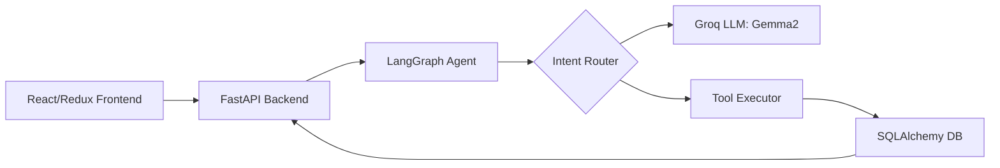

# AI CRM: HCP Interaction Logging System

[](https://github.com/your-repo)
[](https://groq.com/)

A production-grade, agent-augmented CRM platform designed for pharmaceutical sales representatives to seamlessly log and manage Healthcare Professional (HCP) interactions. The system bridges the gap between unstructured field notes and structured medical compliance data using an intelligent orchestration layer.

---

## 🚀 Project Overview

In the pharmaceutical sector, capturing accurate "Field Call" data is critical for compliance and strategy. This system leverages a **LangGraph-based agent** to interpret user intent and route actions through structured tools, ensuring that interactions are captured with high fidelity whether via manual forms or conversational input.

By integrating LLM-driven extraction into the CRM workflow, the platform reduces administrative overhead for sales reps while maintaining the data integrity required for enterprise analytics.

---

## 🛠️ Tech Stack

*   **Frontend**: React, Redux Toolkit, Vite, Tailwind CSS
*   **Backend**: FastAPI (Python), SQLAlchemy ORM
*   **AI Orchestration**: LangGraph, LangChain
*   **LLM**: Groq (LPU Inference) - gemma2-9b-it
*   **Database**: PostgreSQL / SQLite (Development)

---

## 📸 Screenshots

### Interaction Logging UI


### History View


### AI Chat Assistant


---

## 🧠 Key Features

*   **Hybrid Input System**: Seamlessly switch between structured forms and a conversational AI interface.
*   **Intelligent Extraction**: Automatic parsing of HCP names, discussion topics, and clinical outcomes from natural language.
*   **Context-Aware History**: Query past interactions using the agent to retrieve relevant clinical background.
*   **AI-Assisted Corrections**: Modify existing logs via chat commands (e.g., "Correct the follow-up date for Dr. Smith").
*   **Stateful Orchestration**: LangGraph manages the conversation state and guarantees tool-calling reliability.

---

## 🏗️ Architecture



---

## 🔧 LangGraph Tools

The agent utilizes a suite of specialized tools to perform structured operations:

| Tool | Action Type | Purpose |
| :--- | :--- | :--- |
| `log_interaction_tool` | **DB Write** | Persists extracted interaction data to the CRM. |
| `edit_interaction_tool` | **DB Update** | Modifies existing records based on user corrections. |
| `get_hcp_history_tool` | **Retrieval** | Queries historical logs for specific doctor context. |
| `get_last_interaction_tool` | **Retrieval** | Provides immediate context for the most recent entry. |
| `suggest_followup_tool` | **AI Reasoning** | Generates clinical next-steps based on interaction depth. |
| `summarize_interaction_tool`| **AI Extraction** | Distills conversational transcripts into structured summaries. |

---

## 🔄 System Flow

### Pipeline: Log Interaction
`Chat Input` → `Intent Detection` → `Entity Extraction` → `Tool Invocation` → `DB Persistence` → `UI Refresh`

### Pipeline: AI Chat Editing
`User Correction` → `Context Retrieval` → `Delta Generation` → `Redux State Update` → `Form Sync`

---

## 📂 Project Structure

```text
/backend
├── agent.py          # LangGraph workflow definition
├── tools.py          # Agent tool implementations
├── crud.py           # Database operation logic
├── models.py         # SQLAlchemy schemas
└── main.py           # FastAPI entry point
/frontend
├── src/components    # UI Components (Chat, Form, History)
├── src/store         # Redux state management
└── App.jsx           # Main application entry
```

---

## 💡 Why This Project Stands Out

*   **Hybrid Workflow**: Combines the precision of traditional CRM forms with the speed of AI chat.
*   **Enterprise Precision**: Uses a graph-based state machine (LangGraph) instead of a simple linear chatbot.
*   **Real-World Utility**: Directly addresses the "data entry fatigue" problem in medical sales.
*   **Low Latency**: Leverages Groq's LPU for near-instant agent responses and tool execution.

---

## 🧪 How to Run

### Backend
1. `cd backend`
2. `pip install -r requirements.txt`
3. Set `GROQ_API_KEY` in `.env`
4. `python -m uvicorn main:app --reload`

### Frontend
1. `cd frontend`
2. `npm install`
3. `npm run dev`

---

## ⚠️ Challenges & Solutions

*   **Tool/UI Sync**: Solved using a custom event-bus in Redux where AI tool outputs trigger specific field updates.
*   **Context Window Management**: Implemented `get_last_interaction_tool` to keep the agent focused on relevant data without overloading tokens.

---

## 🚀 Future Improvements

*   **Voice Integration**: Direct dictation for field reps.
*   **Predictive Analytics**: Forecasting HCP interest based on historical interaction sentiment.
*   **Multi-Agent Support**: Specialized agents for medical affairs vs. commercial sales.
